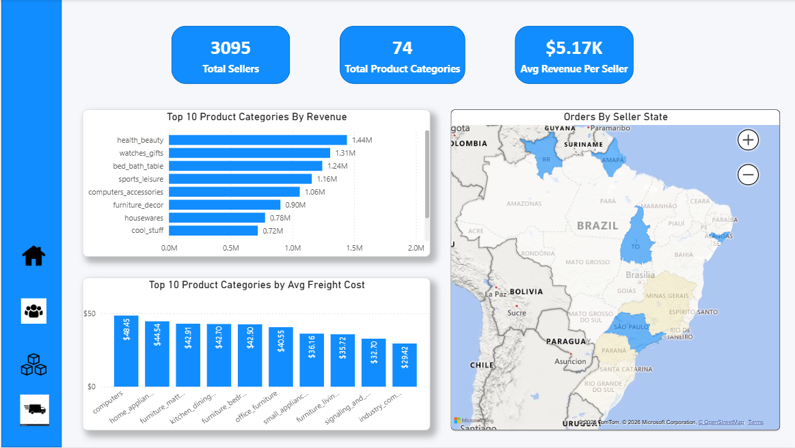
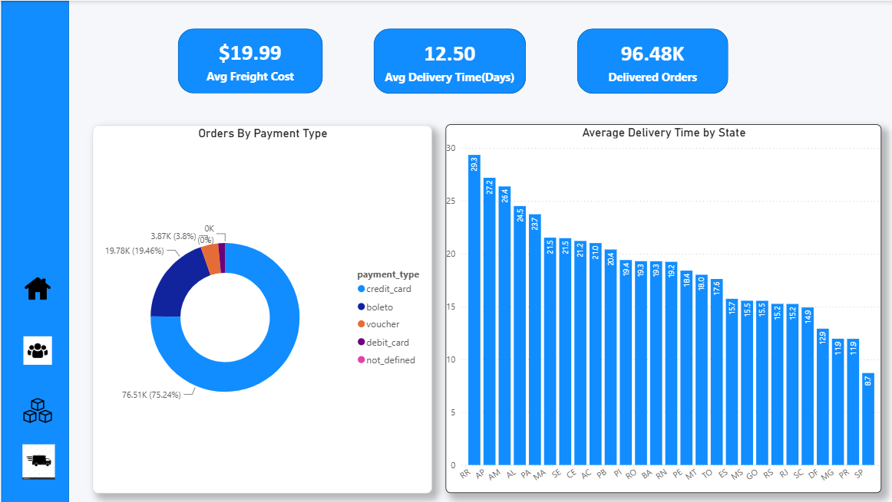

# Brazilian E-Commerce Sales & Customer Analytics Dashboard

## Project Overview

This project showcases an interactive Power BI dashboard built using the Olist Brazilian E-Commerce dataset. It provides actionable insights into sales performance, customer behavior, product performance, seller performance, and delivery operations through interactive visualizations and key performance indicators (KPIs).
---

## Business Objective

To analyze e-commerce business performance by answering key business questions related to:

- Sales Performance
- Customer Behavior
- Product Performance
- Seller Performance
- Order & Delivery Performance
---
## Tools & Technologies

- Power BI Desktop
- Power Query
- DAX (Data Analysis Expressions)
- Data Modeling
---

## Dashboard Pages

### Executive Dashboard
- Revenue Overview
- Orders Overview
- Customer Overview
- Products Sold
- Average Review Score
- Monthly Order Trend

---

### Customer Analysis

Analyzes customer behavior, acquisition, spending patterns, and geographic distribution.

**Features**
- Total Customers
- Repeat Customers
- Average Spend per Customer
- Customer Acquisition Trend
- Top Cities by Customers
- Revenue by Customer State
- Customer Distribution Map

---

### Product & Seller Analysis

Provides insights into product performance and seller distribution.

**Features**
- Total Sellers
- Revenue per Seller
- Top Product Categories by Revenue
- Orders by Seller State
- Average Freight Cost by Product Category

---

### Order & Delivery Analysis

Analyzes order fulfillment, delivery performance, and payment methods.

**Features**
- Average Delivery Time
- Delivered Orders
- Average Freight Cost
- Orders by Payment Type
- Average Delivery Time by State

---

## Key Performance Indicators (KPIs)

- Total Revenue
- Total Orders
- Total Customers
- Products Sold
- Average Review Score
- Repeat Customers
- Average Spend per Customer
- Total Sellers
- Revenue per Seller
- Average Delivery Time
- Delivered Orders
- Average Freight Cost
---

## Dataset

**Olist Brazilian E-Commerce Public Dataset**

The dataset contains information related to:
- Customers
- Orders
- Products
- Sellers
- Payments
- Reviews
- Deliveries
---

## Skills Demonstrated

- Data Cleaning
- Data Transformation
- Data Modeling
- DAX Calculations
- Dashboard Design
- Data Visualization
- Business Intelligence
- Business Insight Generation
---

## Developed By

Raviteja Singavarapu

